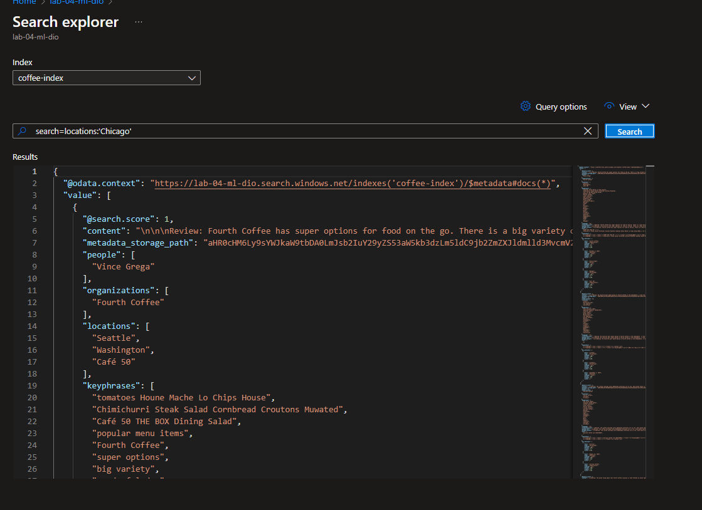

<h1>
    <a href="https://www.dio.me/">
     </a>
    <span> 
Azure Cognitive Search: Utilizando AI Search para indexação e consulta de Dados</span>
</h1>

## Problema:

O desafio propõe que seja criada uma pesquisa que funcione juntamente com um serviço de inteligência artificial para identificar palavras chave, sentimentos, utilizando também o serviço de armazenamento do azure.

[Documentação](https://microsoftlearning.github.io/mslearn-ai-fundamentals/Instructions/Labs/11-ai-search.html)

## Passo 1: Criando recurso do Azure AI Search:     

 ...  

## Passo 2: Criando recurso do Azure AI services:      

 ... 

## Passo 3: Criando o storage:      

 ... 
 ... 

## Passo 3: Permitindo acesso anônimo ao Blob:      

Como nosso laboratório é apenas didático,para aprender os princípios da inteligência artificial com o Azure, precisamos permitir o acesso anônimo ao blob para simplificar e facilitar nossas implementações, Após criar o seu Storage, entre no mesmo e navegue até a guia SETTINGS > CONFIGURATION seguindo os passos abaixo:

 ... 


## Passo 5: Criando o Container:      

Navegue até a guia DATA STORAGE > CONTAINERS, para criar o container dentro do storage e adicionar as pesquisas que serão analisadas pelo AI SERVICE.

 ...   
 ...  

## Passo 6: Importação e indexação dados para o AI SEARCH:      

Neste ponto você precisa linkar / importar os dados que você inseriu e configurou no seu STORAGE, volte para o AI SEARCH e siga os passos abaixo:

 ... 

## Passo 6: Consultando o índice:      

Feitas todas as configurações vamos voltar ao AZURE AI SERVICES, entrar no nosso serviço e através do SEARCH EXPLORER testar se tudo foi indexado e se a consulta esta funcionando, utilizando os comandos:

 ... 

```
search=*&$count=true    (  verifica se a indexação esta funcionando e mostra os documentos )
```
 ... 

```
search=locations:'Chicago' ( Consulta as ocorrências acontecidas em Chicago )
```
 ... 

```
search=sentiment:'negative' ( Consulta as ocorrências com sentimento negativo )
```
 ... 


## Observações finais:      

As ferramentas de inteligencia artificial do Azure facilitam a consulta em documentos, pesquisas e depoimentos, agilizando ainda mais a consulta de satisfação de empresas sobre seus produtos e serviços.


